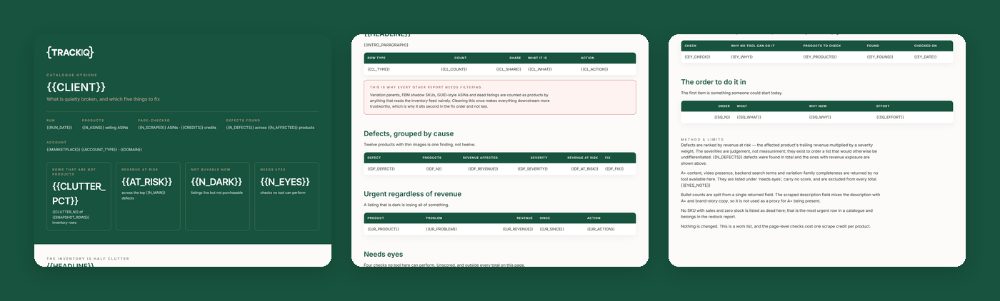

# TrackIQ: Amazon Catalog and Variation Hygiene Audit

The housekeeping nobody does, because it is nobody's job and no single item is urgent.

**What is quietly broken across the catalogue, and which five things are worth fixing?**

Part of **Amazon Listing Management & Optimization** in the
[TrackIQ skills catalog](https://github.com/TrackIQ-HQ/amazon-seller-skills).

Built as an [Agent Skill](https://code.claude.com/docs/en/skills). Runs in
Claude Code, Claude web, Claude desktop and ChatGPT from the same folder.

---

## ⚠ This skill needs a scraper connection

Part of what this reads only exists on the public product page, so it needs an
**Oxylabs scraper** connection alongside the TrackIQ MCP. Scraper calls cost
credits per ASIN or keyword per run, and the skill states the run's cost in its
output.

There is no first-party substitute for the scraped fields — the skill says so
rather than approximating them.

---

## Powered by the TrackIQ MCP

[](https://trackiq.com/mcp)

This skill reads your live Amazon account through the
**[TrackIQ MCP](https://trackiq.com/mcp)** — 16 tools connecting your AI
assistant to Amazon data:

Sales & Traffic · Orders · Inventory · Returns · Sponsored Products · Sponsored
Brands · Sponsored Display · Amazon DSP · AMC Cloud · Keywords · Search Terms ·
Targeting · Search Query Performance · Organic Rank · Best Seller Rank · Buy Box
History · Brand Analytics · Export

Works with Claude, ChatGPT and Cursor. **[Get access →](https://trackiq.com/mcp)**

---

## What you get



Sweeps a whole Amazon catalogue for the quiet defects nobody owns — thin image sets, truncating or short titles, bullet counts above or below what displays, orphaned and duplicate SKUs, dead and GUID listings cluttering the inventory, products with no ads and no traffic, and listings that are live but not buyable — ranked by revenue at risk so the list is finite. Use when the user asks for a catalogue audit, listing hygiene, what is broken across our listings, catalogue cleanup, orphan ASINs, or a health check across all products.

### The rules that keep it honest

- **Four of the checks a client will expect cannot be automated**
- **`description` is not the description**
- **`bullet_points` is one newline-joined string**
- **Most inventory rows are not products**

The full list is in `SKILL.md`, and each one exists because getting it wrong
produces a confident, wrong answer rather than an obvious error.

## Requirements

- The TrackIQ MCP, for `list_marketplaces`, `get_product_performance`, `get_inventory_snapshot` and `get_product_ads`. - **The Oxylabs scraper** for the page-level checks — `get_product`, one credit per ASIN. On a 60-ASIN catalogue that is 60 credits; agree the scope first. - Nothing else. No filesystem, no shell. - **Without Oxylabs:** the inventory and performance checks still work and are half the value. Say which half is missing rather than implying a full sweep.

---

## Install

### Claude Code

```
/plugin marketplace add TrackIQ-HQ/amazon-seller-skills
/plugin install trackiq-amazon-catalog-hygiene@trackiq
```

### Claude web, desktop, mobile

1. Download the `.zip` from the
   [latest release](https://github.com/TrackIQ-HQ/trackiq-amazon-catalog-hygiene/releases)
2. **Settings → Capabilities → Skills** (code execution must be on)
3. **Create skill → Upload a skill**, choose the `.zip`
4. Toggle it on

### ChatGPT

Same zip. **Plugins → Skills → Create → Upload from your computer.**

---

## Setup

Answers live in `account.md`, copied from
[`assets/account.example.md`](skills/trackiq-amazon-catalog-hygiene/assets/account.example.md).
**Every TrackIQ skill reads the same file**, so an account already set up for
another TrackIQ report needs nothing added.

## Delivery

Asked once and stored in `account.md`: **in-chat** (default), **file**,
**Slack**, **n8n** or **email**. Anything leaving the chat confirms with you
first and falls back to in-chat, with a note.

---

## Customizing

| File | What it controls |
|---|---|
| `checklist.md` | the pre-send checks |
| `checks.md` | the pre-send checks |
| `method.md` | the method and every threshold |
| `report-template.html` | the report shell |

---

## Contributing

```bash
python scripts/validate.py    # must exit 0 before any commit
python scripts/build.py       # writes dist/ zip + registry.json
```

Read [AUTHORING.md](https://github.com/TrackIQ-HQ/amazon-seller-skills/blob/main/AUTHORING.md)
before proposing changes.

## License

MIT. See [LICENSE](LICENSE).
